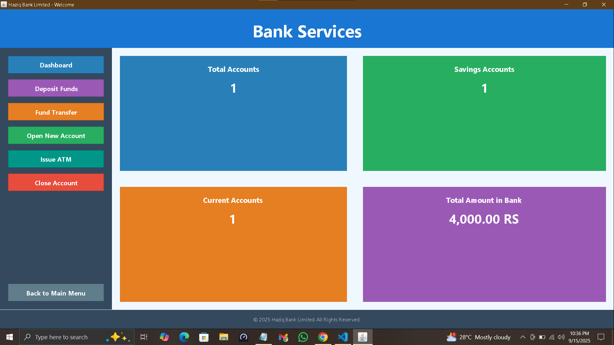
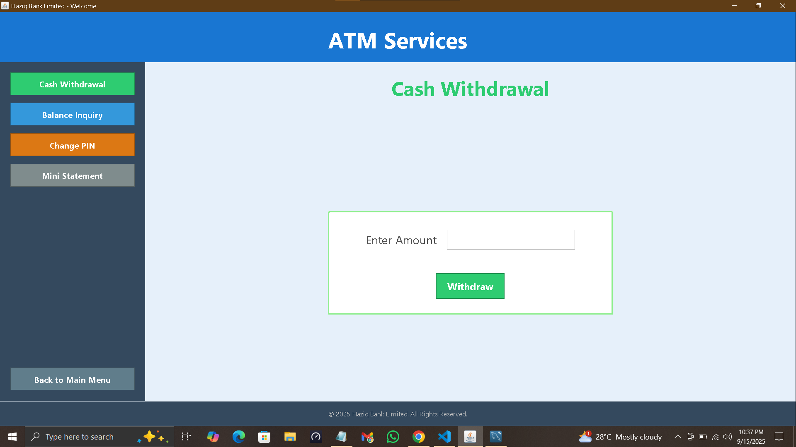
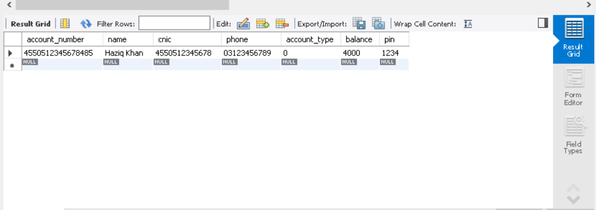

# 🚀 Bank Management System

## 📖 Description
This project is a **Java + MySQL based Bank Management System** developed as part of our Software Engineering coursework.  
It provides essential banking functionalities with a user-friendly interface and secure database integration.

### ✨ Features
- Open **Current / Saving Accounts**
- Deposit and Transfer Funds
- Cash Withdrawal
- Close Accounts
- Real-time Database Integration with MySQL

## 🎥 Demo
➡️ [Click here to watch full demo](https://www.linkedin.com/posts/haziq-khan-501b8a363_java-mysql-swing-activity-7373428534209507328-afL-?utm_source=share&utm_medium=member_desktop&rcm=ACoAAFpowlEBylMi5Oj5rSEj2rbQpoL1ihttrz4)  

  

## 📸 Screenshots
### Bank
  

### ATM
  

### Database View
  

## 🛠 Tech Stack
- Java  
- Java Swing  
- MySQL  

## 👨‍💻 Authors
- **Haziq Khan**
## 👨‍💻 Contibutors
<a href="https://github.com/Ahtisham-1214">**Ahtisham Sheikh** </a>

---

## 🗄️ Database Setup
Run the following SQL script to create the required table:

```sql
CREATE TABLE accounts (
  account_number VARCHAR(16) PRIMARY KEY,
  name VARCHAR(30) NOT NULL,
  cnic VARCHAR(13) UNIQUE NOT NULL,
  phone VARCHAR(11) UNIQUE NOT NULL,
  account_type SMALLINT,
  balance DOUBLE,
  pin VARCHAR(4)
);
